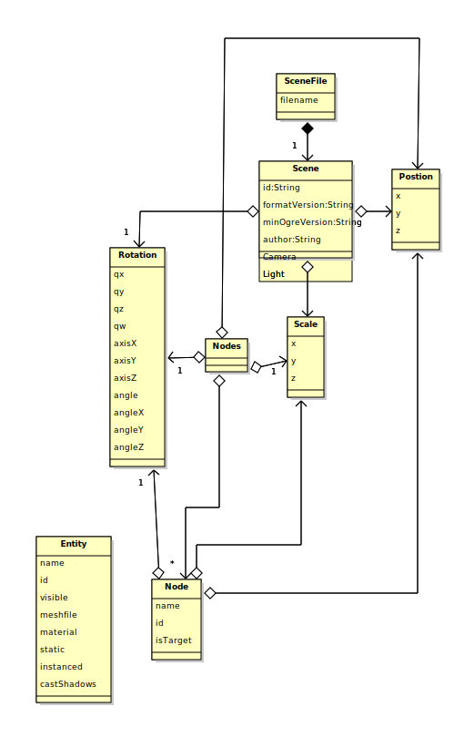

<!-- 
Style headers to match original word template.
-->
<style scoped>
h1 {
  text-align: right !important;
  border-bottom: 0;
}
h2 {
  border-bottom: 0;
  text-align: right !important;
}

</style>

# Ogre Scene File Editor #

## Software Requirements Specification <br> For Ogre Scene File Editor ##

## Version ```0.12``` ##

> [!NOTE]
>  The SRS captures the complete software requirements for the system, or a portion of the system. Following is a typical SRS outline for a project using use-case modelling. This artifact consists of a package containing use cases of the use-case model and applicable Supplementary Specifications and other supporting information. 


### Introduction ###
> [!NOTE] 
> The introduction of the Software Requirements Specification (SRS) provides an overview of the entire document. It includes the purpose, scope, definitions, acronyms, abbreviations, references, and overview of the SRS.

This section provides the Software Requirements Specification (SRS) for the system, including relevant scope definitions, abbreviations etc. The following sections outline the purpose of the SRS, it's scope, relevant definitions etc. This is followed by an overview of the systems behaviour followed by a detailed breakdown of the behaviours of the application. 

### Purpose ###
> [!NOTE] 
> Specify the purpose of this Software Requirements Specification. The SRS fully describes the external behaviors of the application or subsystem identified. It also describes nonfunctional requirements, design constraints, and other factors necessary to provide a complete and comprehensive description of the requirements for the software.

The SRS primarily provides details of the functional requirements of the program expressed via a number of Use Case Documents summarised via Use Case Diagrams. Non-functional requirements, design constrains may also be included where relevant. The team briefly considered splitting this into two subsystem documents (Backend/Frontend) or by feature before concluding that the application was not sufficiently complex to warrant the additional documentation. 

### Scope ###
> [!NOTE] 
> A brief description of the software application that the Software Requirements Specification applies to, the feature or other subsystem grouping, what Use-case model(s) it is associated with, and anything else that is affected or influenced by this document.

The scope of this document is the whole Ogre Scene File Editor.

### Definitions, Acronyms, and Abbreviations ###
> [!NOTE] 
> This subsection provides the definitions of all terms, acronyms, and abbreviations required to properly interpret the Software Requirements Specification.  This information may be provided by reference to the project’s Glossary.

### References ###

Use case documents and diagrams, From Use Cases to Classes: A Way of Building Object Model with UML, written by Ying Liang, published Feb 1 2003, accessed 23/02/2026 

Displaying scene file data, ACM Transactions on Graphics, SIGGRAPH 2021, written by Jonathan Granskog, Till N. Schnabel, Fabrice Rousselle, Jan Novák, published 2021, accessed 26/02/2026

Writting scene files, Hydra: A Real-time Spatial Perception System for 3D Scene Graph Construction and Optimization, written by Nathan Hughes, Yun Chang, Luca Carlone. accessed 26/02/2026

> [!NOTE] 
> This subsection provides a complete list of all documents referenced elsewhere in the Software Requirements Specification. Identify each document by title, report number (if applicable), date, and publishing organization. Specify the sources from which the references can be obtained. This information may be provided by reference to an appendix or to another document.


Please refer to the [Glossary](OgreConfigReader-glossary.md).

### Overview ###
> [!NOTE] 
> This subsection describes what the rest of the Software Requirements Specification contains and explains how the document is organized.

The following sections outline the functional and non-functional requirements of the system. Scenarios (along with their decomposition) are provided by the Use Case documents, the dependencies between these are highlighted by the Use Case Diagram.  Finally the Domain Object Model (DOM) shows domain objects identified at present.

### Overall Description ###
> [!NOTE] 
> This section of the Software Requirements Specification describes the general factors that affect the product and its requirements. This section does not state specific requirements. Instead, it provides a background for those requirements, which are defined in detail in Section 3, and makes them easier to understand. Include such items as product perspective, product functions, user characteristics, constraints, assumptions and dependencies, and requirements subsets.

The Ogre Scene File Editor is a simple tool designed to allow a ```.scene``` file for the Ogre3D Graphics Engine to be viewed or edited. The context for this is that within a small game development team various hand made changes and tests (e.g. lighting, model position/name etc.) can result in:

1. A corrupted file - something which cannot be parsed
2. Meshes/textures etc. being referenced but not being available locally (common)

The principle role of the tool is in loading these files for viewing and where possible editing these file to restore a working configuration.  A secondary goal is the provision of statistics to allow scenes to be compared (e.g. number of lights, models etc.) 

### Use-Case Model Survey ###
 > [!NOTE] 
> If using use-case modelling, this section contains an overview of the use-case model or the subset of the use-case model that is applicable for this subsystem or feature.  This includes a list of names and brief descriptions of all use cases and actors, along with applicable diagrams and relationships.  Refer to the Use-Case-Model Survey Report, which may be used as an enclosure at this point.

The following Use Case have been identified:

1. Display Scene File Data
2. Save Current Scene File 
3. Close Current Scene File
4. Validate Scene File
5. Full Screen Application
6. Resize Application
7. Minimise Application
8. Borderless Fullscreen Application
9. Report Error
10. Ask for Filename
11. Load Scene File
12. Parse Scene Data
13. Validate Scene Data
14. Display Scene Data

### Assumptions and Dependencies ###
> [!NOTE] 
> This section describes any key technical feasibility, subsystem or component availability, or other project related assumptions on which the viability of the software described by this Software Requirements Specification may be based.

It is assumed that users are familiar with the ```.scene``` file format, it's elements and use in other tools at **Gerkin Hammer Games**. Minimal additional information will be required in terms of the expected content of a valid file etc.


### Specific Requirements ###
> [!NOTE] 
> This section of the Software Requirements Specification contains all software requirements to a level of detail sufficient to enable designers to design a system to satisfy those requirements and testers to test that the system satisfies those requirements. When using use-case modelling, these requirements are captured in the use cases and the applicable supplementary specifications. If use-case modelling is not used, the outline for supplementary specifications may be inserted directly into this section.

The Specific Requirements are captured via the following Use Case Reports and Supplementary Specification (see following section).

### Use-Case Reports ###
> [!NOTE] 
> The use cases often define the majority of the functional requirements of the system, along with some non-functional requirements. For each use case in the above use-case model, or subset thereof, refer to, or enclose, the use-case report in this section. Make sure that each requirement is clearly labelled.
>
> Table below provides guidance for completing the UC document.
>
|Use Case Section|Comment|
|---|---|
|Use Case Scope|Start with a verb|
|Use case ID|Give each use case a unique ID. |
|Level|“User Goal” or “Subfunction”|
|Primary Actor|Calls on the system to deliver it’s service, can be a human/system or NA.|
|Stakeholders and interests|Who cares about this use case, and what do they want?|
|Preconditions|What must be true on start, as is worth telling the reader?|
|Success Guarantee (Post-conditions)|What must be true on successful completion, and worth telling the reader. |
|Main Success Scenario|A typical, unconditional happy path (sunny day) scenario of success.|
|Extensions|Alternative scenarios of success or failure. |
|Special Requirements|Related non-functional requirements – be sure to add to supplementary specification!|
|Technology and Data Variations List|Any platform specific issues, for example numerical representation, OS libraries etc. |
|Frequency of Occurrence|How often does this occur, login maybe once per session but operations like saving, sorting etc. more frequent. Some like rendering / animation are timer driven. |

> [!IMPORTANT] 
> The template shows one of potentially hundreds of Use Case (UC).

|   |   |
|---|---|
|Use Case: *id*|*Use Case Name*|
|Scope| |
|Level| |
|Primary Actor| |
|Stakeholders and Interests| |
|Pre-conditions| |
|Success Guarantee| |
|Main Success Scenario| |
|Extensions (alternative flows)| |
|Special Requirements| |
|Technology and Data Variations List| |
|Frequency of Occurrence| |
|Miscellaneous| |

> [!NOTE] 
> While Use Case Reports (Documents) contain the detail, Use Case diagrams can help visualise whole systems or subsystems and provide additional context
>

|   |   |
|---|---|
|Use Case: 1|Display Scene File Data|
|Scope| Displaying the content of a file on screen.  |
|Level| User Goal |
|Primary Actor| Application user. |
|Stakeholders and Interests| Designer: Needs to see a visual representation of the data stored in the file. <br> Developer: Needs to identify missing meshes, textures etc. |
|Pre-conditions| Application is loaded.  |
|Success Guarantee| A file has been parsed an loaded, this is now the current file for future operations. |
|Main Success Scenario| 1. **Ask for Filename** <br> 2. **Load Scene File Data** <br> 3. **Parse Scene File** <br> 4. **Display Scene Data**|
|Extensions (alternative flows)| 2. a) Report File Not Found <br> 3. a) Report parse error <br> |
|Special Requirements| N/A |
|Technology and Data Variations List| XML files usually use a ```LF``` line ending, however files edited in Windows may use ```CRLF``` this must be taken in to account. |
|Frequency of Occurrence| At least once per session. |
|Miscellaneous| N/A |

<br>


<br>
<br>
<br>

|   |   |
|---|---|
|Use Case: 2|Save current scene file|
|Scope|Saving the current scene file on screen|
|Level| User Goal |
|Primary Actor| Application user. |
|Stakeholders and Interests| Designer: Designer would need to save the file they have changed. <br> Developer: Developer would need to save the file they have just changed |
|Pre-conditions| Application is not saved.  |
|Success Guarantee| The file is changed and saved |
|Main Success Scenario| 1. Save Scene <br> 2. Enter file name <br> 3. Check validity od file name <br> 4. Overwrite file save|
|Extensions (alternative flows)| 1. a) No changes to the file were made <br> 2. a) Invalid file name <br> 4. Overwriteing file was Declined and cancels save |
|Special Requirements| N/A |
|Technology and Data Variations List| The file will be saved onto a hard drive in the XML file format and will be visable on desktops such as windows or linux  |
|Frequency of Occurrence| After every small successful milestone |
|Miscellaneous| N/A |

<br>


<br>
<br>
<br>

|   |   |
|---|---|
|Use Case: 3|Close current scene file|
|Scope|Closing the current scene file on screen|
|Level| User Goal |
|Primary Actor| Application user. |
|Stakeholders and Interests| Designer: They would need to eventually close the file they have changed and saved. <br> Developer: They would need to eventually close the file they have just changed and saved |
|Pre-conditions| Application is still open.  |
|Success Guarantee| The file is successfully closed |
|Main Success Scenario| 1. The file is open <br> 2. The user presses on the close button <br> 3. Unload scene file <br> 4. File is closed |
|Extensions (alternative flows)| 1. a) The file was not saved prior <br> 1. b) The remember to save popup appeared <br> 2. a) The file is still open <br> |
|Special Requirements| N/A |
|Technology and Data Variations List| N/A |
|Frequency of Occurrence| After deciding to close the file |
|Miscellaneous| N/A |

<br>


<br>
<br>
<br>

|   |   |
|---|---|
|Use Case: 4|Validate scene file|
|Scope|To validate the current scene file|
|Level|User Goal |
|Primary Actor| Application User |
|Stakeholders and Interests| Designer: Needs to know if the scene file is corrupted from chages made . <br> Developer: Will need to know if there are any problems with the file before adding any more textures or meshes |
|Pre-conditions| Application is unvalidated and not checked.  |
|Success Guarantee| The file is successfully validated |
|Main Success Scenario| 1. The application checks the file for corruption, format and structure  <br> 2. All parts of the file are present and healthy <br> 3. The file succssefully validates and report logs it |
|Extensions (alternative flows)| 1. a) The application detects corruption and can not validate <br> 1. b) Invalid file format <br> 2. a) Parts of the file are missing <br> |
|Special Requirements| N/A |
|Technology and Data Variations List| N/A |
|Frequency of Occurrence| After starting the application and after saving the file |
|Miscellaneous| N/A |

<br>


<br>
<br>
<br>

|   |   |
|---|---|
|Use Case: 5|Full Screen Application|
|Scope|To make the application appear fullscreen|
|Level| User Goal |
|Primary Actor| Application user. |
|Stakeholders and Interests| Designer: To see the application enlarged to increase visability to their liking <br> Developer: To see the application enlarged to increase visability and accuracy |
|Pre-conditions| Application is not fullscreen.  |
|Success Guarantee| The Application is made fullscreen |
|Main Success Scenario| 1. File is open <br> 2. Maximise window button presed <br> 3. Application is resized to fullscreen in UI layout |
|Extensions (alternative flows)| 3. a) Disrupts other applications while Maximised |
|Special Requirements| N/A |
|Technology and Data Variations List| N/A |
|Frequency of Occurrence| Whenever the user wants to see the application enlarged |
|Miscellaneous| N/A |

<br>


<br>
<br>
<br>

|   |   |
|---|---|
|Use Case: 6|Resize Application|
|Scope|To change the size of the application|
|Level| User Goal |
|Primary Actor| Application user. |
|Stakeholders and Interests| Designer: To change the size of the application to their liking or preference <br> Developer: To change the size of the application to their liking |
|Pre-conditions| Application is not sized to their liking. |
|Success Guarantee| The Application is resized to the users liking |
|Main Success Scenario| 1. File is open <br> 2. Restore down window button presed <br> 3. Application is resized in UI layout <br> |
|Extensions (alternative flows)| 1. a) File is not open <br> 2. a) Application fails to restore down <br> 2. b) Window is a fixed size|
|Special Requirements| N/A |
|Technology and Data Variations List| N/A |
|Frequency of Occurrence| Whenever the user wants to see the applications size to be changed |
|Miscellaneous| N/A |

<br>


<br>
<br>
<br>

|   |   |
|---|---|
|Use Case: 7|Minimise Application|
|Scope|To minimize the application back to the task bar|
|Level| User Goal |
|Primary Actor| Application user. |
|Stakeholders and Interests| Designer:  <br> Developer:  |
|Pre-conditions| Application is not fullscreen.  |
|Success Guarantee| The Application is Minimised |
|Main Success Scenario| 1. File is open <br> 2. Minimise button is pressed <br> 3. Application is minimised |
|Extensions (alternative flows)| 1. a) File is not open <br> 2. a) The OS denies the request <br> 3. a) Applications still remains on screen |
|Special Requirements| N/A |
|Technology and Data Variations List| N/A |
|Frequency of Occurrence| Whenever the user wants to see the application to be minimised |
|Miscellaneous| N/A |

<br>


<br>
<br>
<br>

|   |   |
|---|---|
|Use Case: 8|Borderless Fullscreen Application|
|Scope| To have the Application fullscreen but borderless |
|Level| User Goal |
|Primary Actor| Application user. |
|Stakeholders and Interests| Designer: Allows them to make the application instantly multi monitor friendly and in some cases can help you reduce crashing <br> Developer: Allows them to make the application instantly multi monitor friendly and in some cases can help you reduce crashing |
|Pre-conditions| Application is in fullscreen |
|Success Guarantee| The Application is made Borderless but stays fullscreeen |
|Main Success Scenario| 1. Application is open <br> 2. Application is fullscreen <br> 3. F11 or 'ForceWindowingMode=0' to make the application borderless <br> 4. Application is made borderless|
|Extensions (alternative flows)| 1. File is not open <br> 2. Application is not fullscreen <br> 4. Application is still fullscreen and not borderless |
|Special Requirements| N/A |
|Technology and Data Variations List| N/A |
|Frequency of Occurrence| When the user wants the application fullscreen but borderless |
|Miscellaneous| N/A |

<br>


<br>
<br>
<br>

|   |   |
|---|---|
|Use Case: 9|Report Error|
|Scope| To report a portion of the file that is invalidated |
|Level| Subfunction |
|Primary Actor| N/A |
|Stakeholders and Interests| Designer: To know if there are any errors  <br> Developer: |
|Pre-conditions| An error has to be present |
|Success Guarantee| The error is reported correctly |
|Main Success Scenario| 1. Detect error <br> 2. View error report <br> 3. Display the error message <br> 4. Log the error report <br> 5. Retry operation again |
|Extensions (alternative flows)| 4. a) Logging of the error report fails <br> 4. b) User cancels the report <br> 5. Retry operation again fails |
|Special Requirements| N/A |
|Technology and Data Variations List|  |
|Frequency of Occurrence| Every time an error is found |
|Miscellaneous| N/A |

<br>


<br>
<br>
<br>

|   |   |
|---|---|
|Use Case: 10|Ask for Filename|
|Scope| Finding out the name for the file in the application |
|Level| User Goal |
|Primary Actor| Application User |
|Stakeholders and Interests| Designer: Will need to know the name of the file to get back onto it if lost <br> Developer: Will need to be able to know which file is which so they dont get confused |
|Pre-conditions| File must have a name |
|Success Guarantee| The name of the file is given when asked for |
|Main Success Scenario| 1. Request name of the file <br> 2. Enter the name of the file you want <br> 3. Name of file is validated <br> 4. Confirm the file name |
|Extensions (alternative flows)| 3. a) File name already exists |
|Special Requirements| N/A |
|Technology and Data Variations List| N/A |
|Frequency of Occurrence| Whenever the file name is needed |
|Miscellaneous| N/A |

<br>


<br>
<br>
<br>

|   |   |
|---|---|
|Use Case: 11|Load Scene File Data|
|Scope| Loading the scene data into an internal representation. |
|Level| Subfunction |
|Primary Actor| N/A |
|Stakeholders and Interests| N/A |
|Pre-conditions| The filename has been provided by the UI layer. |
|Success Guarantee| The file is loaded into a local buffer, or an error is reported. |
|Main Success Scenario| 1. Load file <br> 2. Select the file <br> 3. Read the file <br> 4. Parse the data on in the scene <br> 5. Load the scene objects <br> 6. Display the scene |
|Extensions (alternative flows)| 1. a) File not found. <br> 1. b) File is corrupted <br> 3/4. Errors upon loading |
|Special Requirements| N/A |
|Technology and Data Variations List| N/A |
|Frequency of Occurrence| At least once per session. |
|Miscellaneous| N/A |

<br>


<br>
<br>
<br>

|   |   |
|---|---|
|Use Case: 12|Parse Scene File Data|
|Scope| Converting the stored XML information to an internal representation for output and manipulation. |
|Level| Subfunction |
|Primary Actor| N/A |
|Stakeholders and Interests| N/A |
|Pre-conditions| File has been loaded into a buffer for parsing. |
|Success Guarantee| File data loaded into a suitable internal representation or a null pointer and error message. |
|Main Success Scenario| 1. Parse Scene 2. <br> Parse Nodes 3. <br> Parse Node Information (for supported types). |
|Extensions (alternative flows)| 1. Scene Parse Error  |
|Special Requirements| Not all possible file constituents are currently used, prioritise those used in game!  |
|Technology and Data Variations List| N/A |
|Frequency of Occurrence| At least once per session. |
|Miscellaneous| N/A |

<br>


<br>
<br>
<br>

|   |   |
|---|---|
|Use Case: 13|Validate Scene Data|
|Scope| To check the data of the file for corruptions |
|Level| Subfunction |
|Primary Actor| N/A |
|Stakeholders and Interests| N/A |
|Pre-conditions| Scene data must be invalidated |
|Success Guarantee| No errors or corruptions in the scene data are found |
|Main Success Scenario| 1. Check the required elements <br> 2. Validate the object properties <br> 3. Validate the refrences <br> 4. Check compatability of the version <br> 5. Confirmation of validation success |
|Extensions (alternative flows)| 2. a) Missing object required <br> 2. b) Property values are invalid |
|Special Requirements| N/A |
|Technology and Data Variations List| N/A |
|Frequency of Occurrence| At least once per session |
|Miscellaneous| N/A |

<br>


<br>
<br>
<br>

|   |   |
|---|---|
|Use Case: 14|Display Scene Data|
|Scope| Displays the scene data on screen, formatting is appropriate for the data presented. |
|Level| Subfunction. |
|Primary Actor| N/A |
|Stakeholders and Interests| N/A |
|Pre-conditions| Current file has an internal representation. |
|Success Guarantee| Scene data on screen.  |
|Main Success Scenario| 1. Display scene stats <br> 2. Display visualisation |
|Extensions (alternative flows)| 1. a) Report missing data 2. a) Report error 2. b) Draw error icon. |
|Special Requirements| See [Supplementary Specification](OgreSceneFileEditor-SS.md) for UI detail.|
|Technology and Data Variations List| N/A |
|Frequency of Occurrence| At least once per session.|
|Miscellaneous| Must stay in sync with the underlying representation. |

<br>


<br>
<br>
<br>

|   |   |
|---|---|
|Use Case: 15|Write scene file|
|Scope| Writing what was modified on the file |
|Level| Subfuntion |
|Primary Actor| N/A |
|Stakeholders and Interests| Designiner: They need to make sure they can make changes to the file <br> Developer: Will need to make sure they can later the file to their liking |
|Pre-conditions| Scene file is unsaved and unaltered |
|Success Guarantee| File updates and adds what was changed |
|Main Success Scenario| 1. Select file location <br> 2. Validate scene data <br> 3. Save file to disc <br> 4. Check permissions <br> 5. Confirm success and log |
|Extensions (alternative flows)| 2. a) Invalid scene data <br> 3. Disc storage is full <br> 4. Permission to overwrite is declined |
|Special Requirements| N/A |
|Technology and Data Variations List| N/A |
|Frequency of Occurrence| Upon every save |
|Miscellaneous| N/A |

<br>


|   |   |
|---|---|
|Use Case: 16|Display Scene in Tree view|
|Scope|Display scene in a tree view|
|Level| User goal |
|Primary Actor| Developer |
|Stakeholders and Interests| Designiner: Ensures the scene and its contents are rrad correctly |
|Pre-conditions| The file must be able to be opened |
|Success Guarantee| Scene is displayed in a tree view |
|Main Success Scenario| 1. File is opened <br> 2. Tree view is present <br> 3. The scene contents are displayed |
|Extensions (alternative flows)| 1. a) file is unable to be opened |
|Special Requirements| N/A |
|Technology and Data Variations List| N/A |
|Frequency of Occurrence| Frequent |
|Miscellaneous| N/A |

<br>


<br>
<br>
<br>

**NOTE:** Most of the UC Documents are missing, remember to add these!

### System Use-Case Diagram ###
> [!NOTE] 
> Where there are multiple subsystems documented separately include a System Use Case for Context.
>


**Note:** While the UC is good for understanding behavioural decomposition (behaviours part of other behaviours) and dependencies it also has it's issues. In this case it's difficult to show that from the command line the saving of the file is implicit in the edit, while in the interactive mode it's separate.

> [!IMPORTANT] Remember to update this as you go!

### Domain Object Model ###
> [!NOTE] 
> Where there are multiple subsystems use package diagrams to express the relationship between subdomains in the object model.
>



**Note**: XML files have a file which describes their structure, i.e. what is legal for each element to contain including it's attributes and children.  I've started to fill this in based on the [DTD for Ogre Scene Files](https://github.com/OGRECave/ogre/blob/master/PlugIns/DotScene/misc/dotscene.dtd)
